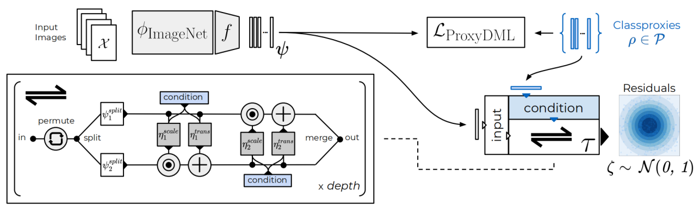
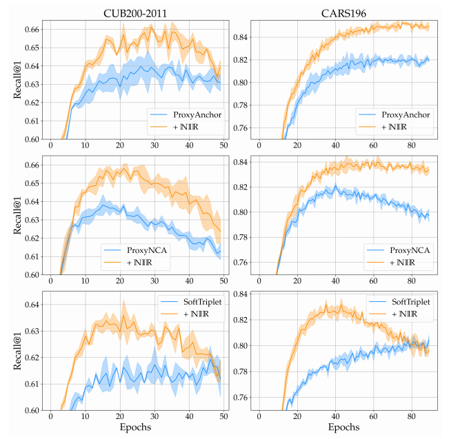

# Non-isotropy Regularization for Proxy-based Deep Metric Learning
#### ___Contact___: Karsten Roth (karsten.rh1@gmail.com)

---
#### Table of Contents:
   * [Introduction](#usage)
   * [Requirements](#requirements)
   * [Quick Guide](#guide)  
   * [Repository & Dataset structures](#repo)
   * [Citation](#citation)   

---
## Introduction


This repository contains the official code for our CVPR 2022 paper on [Non-isotropy Regularization for Proxy-based Deep Metric Learning](#placeholder).

The goal of the proposed approach is to encourage improved resolution of intraclass structures in proxy-based Deep Metric Learning, and enforce feature-richer representation spaces to be captured __while__ retaining the fast convergence benefits of proxy-based methods and under the absence of sample-to-sample contrastive relations and mining heuristics.

In particular, the resulting training runs showcase much higher generalization performance, even when applied on top of already very strong proxy-based objectives with little hyperparameter tuning and in parts even __increased__ convergence speeds:



_Note:_ This repository is build on top of preceding work [here](https://github.com/Confusezius/Revisiting_Deep_Metric_Learning_PyTorch).

---
## Requirements
This repository has been built and tested around `Python 3.8` and `PyTorch 1.9+`. The required libraries and their installation process can be found in `requirements.sh`.

For example, one can create a simple conda environment via
```
wget  https://repo.continuum.io/miniconda/Miniconda3-latest-Linux-x86_64.sh
bash Miniconda3-latest-Linux-x86_64.sh # say yes to append path to bashrc.
source .bashrc
conda create -n Env python=3.8
conda activate Env
```

and then install the required libraries following `requirements.sh`.


---
## Quick Guide

### Rerunning baselines and language-guided variants.
The required setup for each benchmark dataset is explained in the subsequent sections. In general, datasets can be downloaded e.g. from
* [CUB200-2011](http://www.vision.caltech.edu/visipedia/CUB-200.html)
* [CARS196](https://ai.stanford.edu/~jkrause/cars/car_dataset.html)
* [Stanford Online Products](http://cvgl.stanford.edu/projects/lifted_struct/)


The main training script is `main.py`, with an exemplary call given here:

```
python main.py --seed 2 --log_online --group cub200-rn128_proxyanchor_baseline --no_train_metrics --project NIR --gpu $gpu --source_path $datapath \
--dataset cub200 --n_epochs 100 --tau 100 --gamma 1 --arch resnet50_frozen_normalize --embed_dim 128 --loss oproxy --bs 90
```

This run trains a 128-dimensional (--embed_dim) metric space spanned over ResNet50 features with normalized embeddings and frozen BatchNorm (given via `--arch`) using a ProxyAnchor loss ('--loss', note the use of the `oproxy` objective, which combines both ProxyAnchor and ProxyNCA) for 100 epochs (`--epochs`), no learning rate scheduling (`--tau`, `--gamma`) and without logging metrics on the training data (`--no_train_metrics`).
The training metrics are logged to a [Weights & Biases](https://wandb.ai/) project (`--log_online`, `--project`), with the particular run name given via `--group`. This ensures that changes in `--seed` are assigned to the same overall group.

For further details and additional parameters, please check out `parameters.py`, which contains all available parameters separated by the general purpose and some additional explanation.

To now add __non-isotropy regularization__ on top of your proxy-based DML method, simply set `----loss_nir_w_align` to a value bigger `0`, and append e.g. `--warmup 1` to give the network one epoch to adapt the Normalizing Flows network. While this is not always needed, it is usually not detrimental to performance and helps in cases where more proxies are utilized.

Overall, this gives:

```
python main.py --seed 2 --log_online --group cub200-rn128_proxyanchor_nir --no_train_metrics --project NIR --gpu $gpu --source_path $datapath \
--dataset cub200 --n_epochs 100 --tau 100 --gamma 1 --arch resnet50_frozen_normalize --embed_dim 128 --loss multisimilarity --bs 90 \
--warmup 1 --loss_nir_w_align 0.0075
```

For further non-isotropy regularization hyperparameters, check out `parameters.py > nir_parameters()`.

Finally, various replication runs on all benchmarks are given in `nir_benchmark_runs.sh`.
As usual, with changes in software versioning and hardware, convergence may slightly differ, so the scheduling parameters need some adaptation to the local setup. However, even without learning rate scheduling, the extended methods should already closely match the existing state-of-the-art with fast convergence!


---
## Repository Structure & Expected Dataset Structures.

### Repository
The repository has the following structure:

```
Repository
|
│   README.md # Base Readme.
│   requirements.sh # List of required libraries.
│   language_guidance_benchmark_runs.sh # Sample benchmark runs.
|   main.py # main training script)
|   parameters.py # collection of pipeline and training parameters.
│   
└───criteria # available baseline objectives
|    │   e.g. margin.py
│   
└───batchminer # available batchmining heuristics
|    │   e.g. distance.py
│   
└───datasampler # methods to construct minibatches.
|    │   e.g. class_random_sampler.py
│   
└───metrics # Folder of standard DML evaluation metrics.
|    │   e.g. mAP.py
│   
└───evaluation # Main evaluation protocols.
|    │   Only __init__.py
│   
└───datasets # Main DML benchmarks.
|    │   e.g. cub200.py
│   
└───utilities # Some utility and misc. functions.
|    │   e.g. logger.py
|
└───Training_Results (will be generated during Training)
|    │   contains folders based on dataset names, e.g. cub200. These folders then contain each run.
```

### Dataset Structures
The benchmarks are expected to follow these setups in order to be directly usable with the provided dataloaders, and path to the respective parent folder should be passed to the main training script via `--datapath <path_to_parent_folder>`. The dataset folder name is passed via `--dataset <dataset_name>`.

__cub200__
```
cub200
└───images
|    └───001.Black_footed_Albatross
|           │   Black_Footed_Albatross_0001_796111
|           │   ...
|    ...
```

__cars196__
```
cars196
└───images
|    └───Acura Integra Type R 2001
|           │   00128.jpg
|           │   ...
|    ...
```

__online_products__
```
online_products
└───images
|    └───bicycle_final
|           │   111085122871_0.jpg
|    ...
|
└───Info_Files
|    │   bicycle.txt
|    │   ...
```


---
## Citation
If you use this code or parts of it for you work, please cite
```
@conference{RotVinAka22b,
  title = {Non-isotropy Regularization for Proxy-based Deep Metric Learning},
  author = {Roth, K. and Vinyals, O. and Akata, Z.},
  booktitle = {Proceedings of the IEEE/CVF Conference on Computer Vision and Pattern Recognition (CVPR)},
  pages = {7420--7430},
  month = jun,
  year = {2022},
  doi = {},
  url = {https://openaccess.thecvf.com/content/CVPR2022/papers/Roth_Non-Isotropy_Regularization_for_Proxy-Based_Deep_Metric_Learning_CVPR_2022_paper.pdf},
  month_numeric = {6}
}
```
